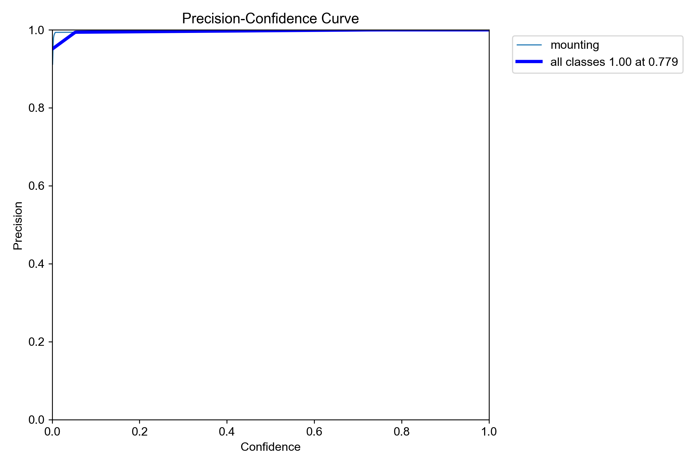
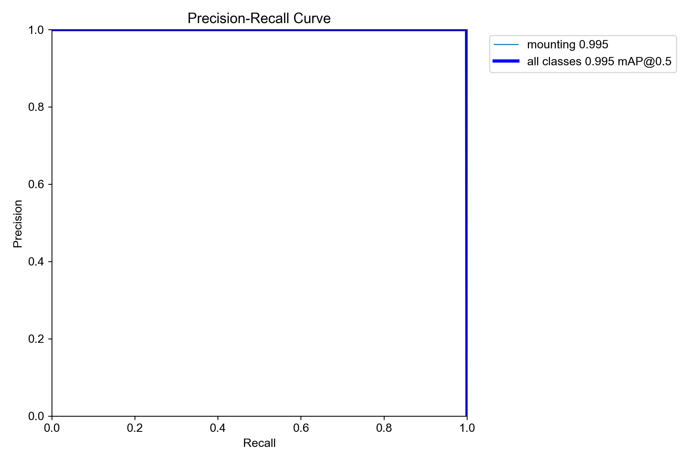
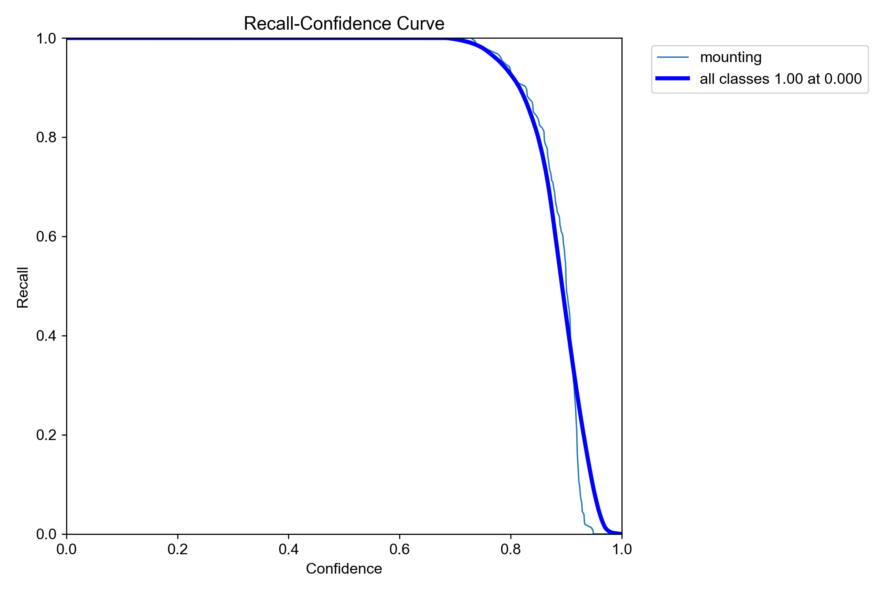
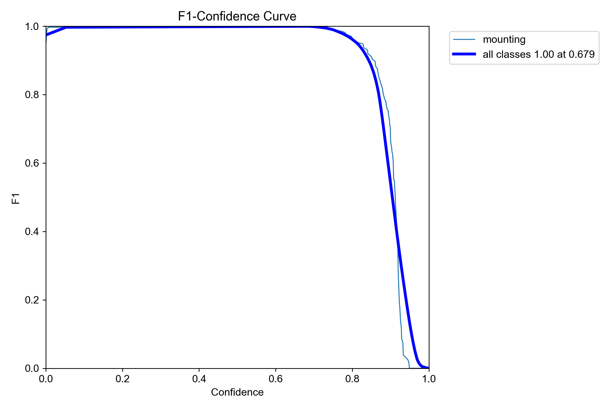
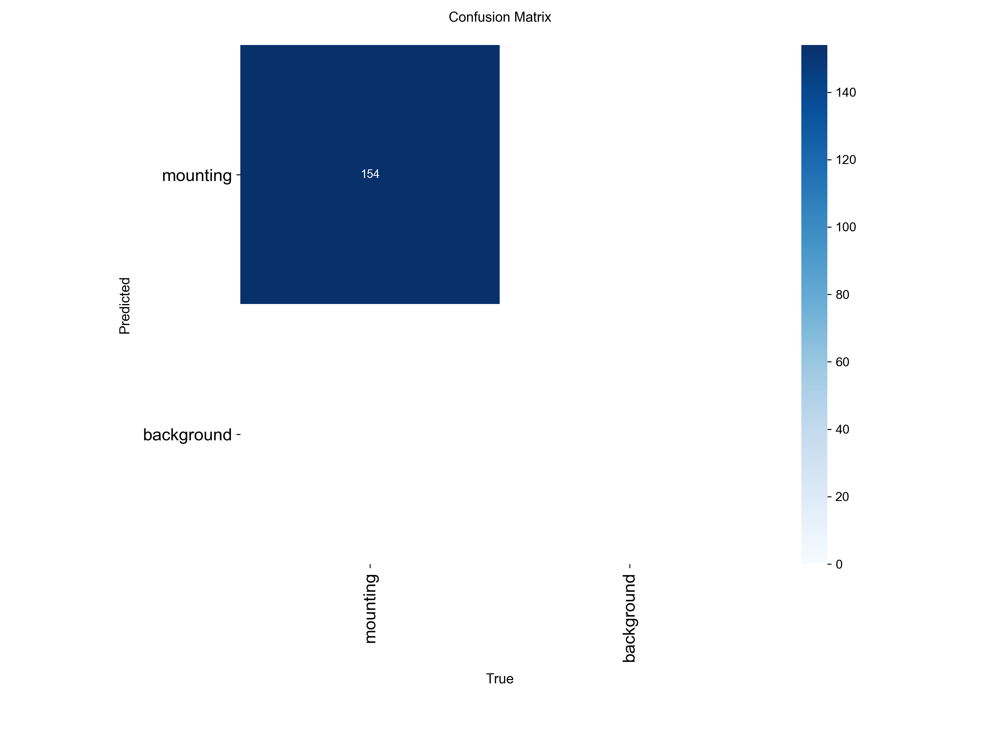
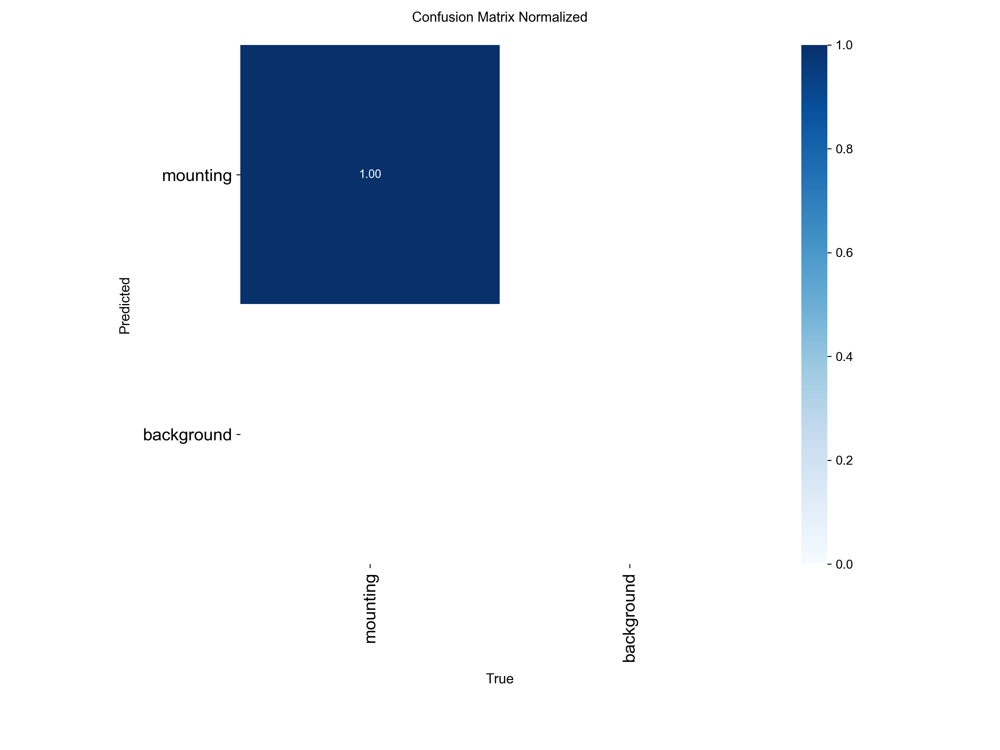
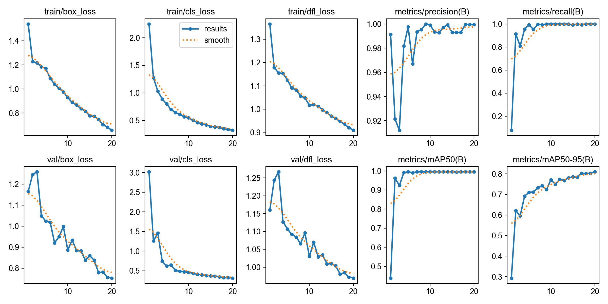

# 🐄 Cow Mounting Detector

基于 YOLOv8 的母牛爬跨行为检测系统，用于畜牧业智能化管理，辅助精准配种。

[](https://www.python.org/)
[](https://github.com/ultralytics/ultralytics)
[](LICENSE)

---
## 🎯 项目背景与动机

本项目源于与某养牛农场的合作交流。农场方在考察了我方此前开发的**母猪发情智能检测系统**后，认为类似的技术方案对其牛群管理同样具有参考价值。然而，牛场的摄像头覆盖密度远不及猪场，难以直接复用原有的多视角监控方案。

因此，我们借鉴了**母猪爬跨行为检测**的技术思路，将模型迁移至**母牛爬跨行为**的识别任务上，作为辅助农场进行发情鉴定和精准配种的轻量化工具。

### 为什么指标这么高？

模型在测试集上的 **mAP@0.5 达到了 0.995**，这一数值确实非常亮眼。但我们想客观说明：

| 项目 | mAP | 识别目标 | 难度说明 |
|------|-----|---------|----------|
| **母牛爬跨检测（本项目）** | **0.995** | 母牛爬跨行为（整体轮廓） | 目标在图像中占比大，形态特征明显，即使低分辨率下也可辨识 |
| 母猪发情检测 | ~0.925 | 母猪水门区域 | 小目标，细节要求高 |
| 玉米霉变检测 | ~0.934 | 玉米颗粒霉斑 | 密集型小目标，背景干扰大 |

> 📌 **结论**：母牛爬跨模型的高 mAP 主要得益于**任务本身特征显著、目标尺度大**，而非模型能力显著优于其他项目。不同任务之间的指标对比意义有限，适合各自场景的模型才是好模型。

### 实际应用价值

尽管任务难度相对较低，但该模型在农场场景中具有明确的实用价值：
- ✅ **单摄像头即可部署**，无需改造现有设施
- ✅ **实时检测**，辅助人工观测，降低漏检率
- ✅ **轻量化设计**，可在边缘设备（如 Jetson Nano）上运行


## 📊 模型性能

| 指标 | 数值 |
|------|------|
| **mAP@0.5** | **0.995** |
| **mAP@0.5:0.95** | **0.95** |
| **Precision** | **0.99** |
| **Recall** | **0.99** |
| **F1-Score** | **1.00** |

### 性能曲线

| Precision-Confidence Curve | Precision-Recall Curve |
|:---:|:---:|
|  |  |

| Recall-Confidence Curve | F1-Confidence Curve |
|:---:|:---:|
|  |  |

### 混淆矩阵

| Confusion Matrix | Normalized |
|:---:|:---:|
|  |  |

### 训练过程



---

## 🚀 快速开始

### 1. 克隆仓库

```bash
git clone https://github.com/hehaha644329615/Cow-Mounting-Detector.git
cd Cow-Mounting-Detector
```

## 安装依赖
```bash
pip install -r requirements.txt
```

## 运行检测
```bash
### 检测单张图片
python src/detect.py --image demo/images/sample.jpg

### 检测整个目录
python src/detect.py --source demo/images/

### 检测视频
python src/detect.py --source demo/videos/demo.mp4
```


##  项目结构
Cow-Mounting-Detector/
├── models/                 # 模型权重文件
│   └── best.pt            # 训练好的权重
├── results/               # 训练结果
│   ├── curves/            # 性能曲线
│   ├── confusion/         # 混淆矩阵
│   ├── batches/           # 训练批次可视化
│   ├── results.png        # 训练总览
│   └── results.csv        # 训练日志
├── src/                   # 源代码
│   └── detect.py          # 检测脚本
├── demo/                  # 示例文件
│   ├── images/            # 示例图片
│   └── videos/            # 示例视频
├── requirements.txt       # 依赖列表
└── README.md              # 项目说明

## 数据集
来源: 视频截图

图片数量: 1,540 张

标注格式: YOLO 格式

许可证: CC BY 4.0

## 训练细节
参数	配置
基础模型	YOLOv8n
训练轮数	100 epochs
批量大小	16
输入尺寸	640 × 640
优化器	AdamW
学习率	0.001


